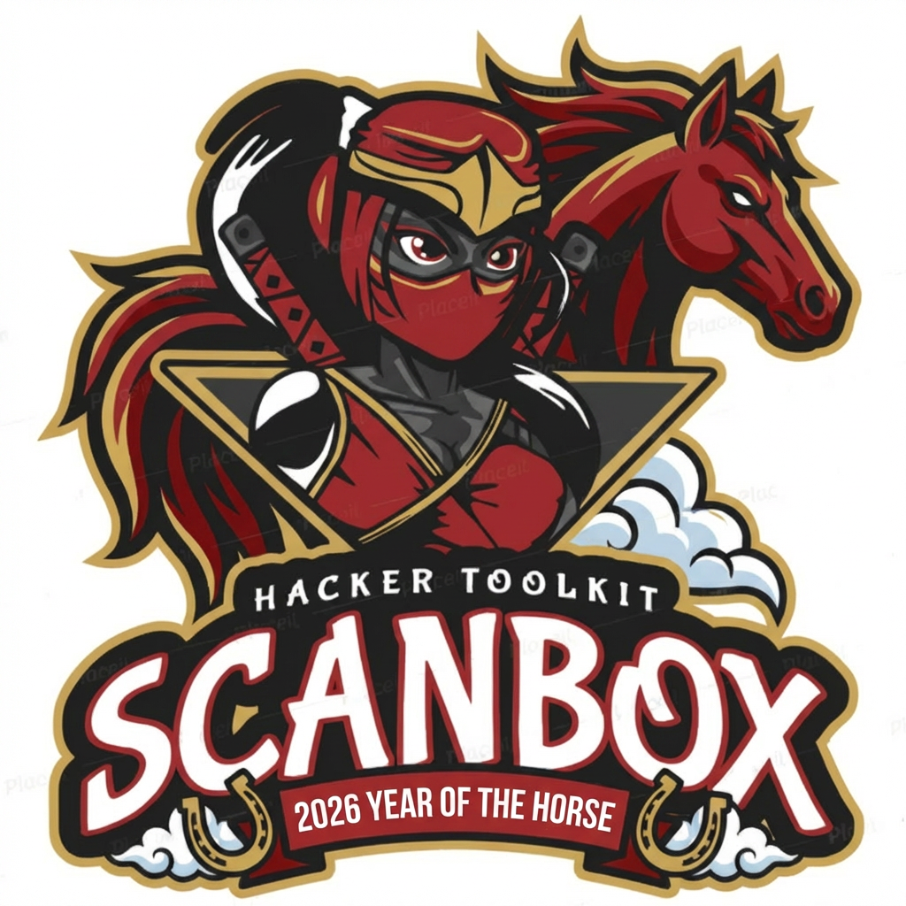

English | [简体中文](./README_CN.md) | [Español](./README_ES.md)
 

 

  
  
 
 
 
 
 

## Introduction

The Ultimate Open-Source Security Arsenal for Hackers, Enterprises, and AI Agents——面向极客、企业与 AI 智能体的全域开源网络安全工具矩阵

> [!TIP]
> **📅 Tired of hunting all over the place for AI agent tools? → [Scanners-Box Daily AI Tool Picks](https://we5ter.github.io/ai-tools/)**

## Contents
<!-- START doctoc generated TOC please keep comment here to allow auto update -->
<!-- DON'T EDIT THIS SECTION, INSTEAD RE-RUN doctoc TO UPDATE -->

> [!IMPORTANT]
> **🤖 AI & Autonomous Agents**
>
> *The focus zone of Scanners Box — AI-driven autonomous security tooling.*
>
> - [AI Autonomous Cybersecurity Agents](#ai-autonomous-cybersecurity-agents)
> - [LLM-Powered Vulnerability Scanners](#llm-powered-vulnerability-scanners)
> - [Security Auditing for AI Agents & Apps](#security-auditing-for-ai-agents--apps)
> - [AI Agent Runtime Controls](#ai-agent-runtime-controls)
> - [Security Auditing for Agent Skills](#security-auditing-for-agent-skills)
> - [Autonomous Vulnerability Discovery and Remediation Skills](#autonomous-vulnerability-discovery-and-remediation-skills)

- [Scanners for Smart Contracts](#scanners-for-smart-contracts)
- [Red Team vs Blue Team](#red-team-vs-blue-team)
- [Mobile App Packages Analysis](#mobile-apps-packages-analysis)
- [Binary Executables Analysis](#binary-executables-analysis)
- [Privacy Compliance](#privacy-compliance)
- [Subdomain Enumeration or Takeover](#subdomain-enumeration-or-takeover)
- [Database SQL Injection Vulnerability or Brute Force](#database-sql-injection-vulnerability-or-brute-force)
- [Weak Usernames or Passwords Enumeration For Web](#weak-usernames-or-passwords-enumeration-for-web)
- [IoT Hardware Automated Audit](#iot-hardware-automated-audit)
- [Mutiple types of Cross-site scripting Detection](#mutiple-types-of-cross-site-scripting-detection)
- [Enterprise sensitive information Leak Scan](#enterprise-sensitive-information-leak-scan)
- [Malware Detection](#malware-detection)
- [Vulnerability Assessment for Middleware](#vulnerability-assessment-for-middleware)
- [Special Vulnerability Categories Scannners for Web](#special-vulnerability-categories-scanners-for-web)
- [Dynamic or Static Code Analysis](#dynamic-or-static-code-analysis)
- [Modular Design Scanners or Vulnerability Detecting Framework](#modular-design-scanners-or-vulnerability-detecting-framework)
- [Advanced Persistent Threat Detect](#advanced-persistent-threat-detect)

<!-- END doctoc generated TOC please keep comment here to allow auto update -->

***

### AI Autonomous Cybersecurity Agents

- https://github.com/vxcontrol/pentagi - **Fully autonomous multi-agent pentesting system in Go — runs whole engagements inside an isolated Docker sandbox with 20+ built-in tools (nmap, metasploit, sqlmap), long-term memory, optional Neo4j knowledge graph, and a web console for human-in-the-loop monitoring**

>       

- https://github.com/oritera/Cairn - **A general-purpose state-space search engine validated on autonomous penetration testing — no predefined roles or workflows, purely goal-driven pathfinding**

>       

- https://github.com/KeygraphHQ/shannon - **Autonomous white-box AI pentester for web apps & APIs — analyzes source code, identifies attack vectors, and executes real exploits pre-production**

>       

- https://github.com/SickHackPark/SickHackShark - **Multi-agent AI platform for CTF automation — covers recon, scanning, exploitation, and flag capture end-to-end**

>       

- https://github.com/SanMuzZzZz/LuaN1aoAgent - **LuaN1ao (鸾鸟) - A next-generation Autonomous Penetration Testing Agent powered by LLMs, integrating P-E-R Agent Collaboration with Causal Graph Reasoning to simulate security expert thinking patterns**

>       

- https://github.com/Ed1s0nZ/CyberStrikeAI - **An AI-native security testing platform in Go, integrating 100+ tools, intelligent orchestration, role-based testing, skills system, full lifecycle management, and a built-in lightweight C2 framework for authorized engagements**

>       

- https://github.com/ASCIT31/Dark-Moon - **Autonomous AI pentesting engine performing continuous offensive security across web, cloud, AD and Kubernetes. Uses agentic reasoning, real exploit execution and attack path analysis to deliver proof-based vulnerabilities.**

>       

### LLM-Powered Vulnerability Scanners

- https://github.com/weareaisle/nano-analyzer - **A minimal LLM-powered zero-day vulnerability scanner by AISLE**

>      

- https://github.com/vercel-labs/deepsec - **An agent-powered vulnerability scanner for on-demand review of all code in existing large-scale repos, surfacing hard-to-find issues that have been lurking in applications for a long time**

>      

- https://github.com/vigolium/vigolium - **High-fidelity vulnerability scanner fusing agentic AI with native speed, modularity, and precision**

>      

### Security Auditing for AI Agents & Apps

- https://github.com/leondz/garak - **LLM vulnerability scanner for hallucination, data leakage, promp injection, misinformation, toxicity generation, jailbreaks, and many other weaknesses**

>      

- https://github.com/protectai/rebuff - **Designed to protect AI applications from prompt injection (PI) attacks**

>      

- https://github.com/mnns/LLMFuzzer - **Fuzzing Framework for Large Language Models**

>      

- https://github.com/Tencent/AI-Infra-Guard - **A.I.G (AI-Infra-Guard) integrates capabilities such as AI infrastructure vulnerability scanning, MCP Server risk detection, and LLM security assessments**

>      

- https://github.com/affaan-m/agentshield - **Security auditor for AI agent configurations — scans Claude Code setups for hardcoded secrets, permission misconfigs, hook injection, MCP server risks and prompt injection vectors; 268 rules across 15 modules, scored 0-100, with auto-fix, CI gating and compliance mapping (SOC 2 / PCI DSS / ISO 27001)**

>      

### AI Agent Runtime Controls

- https://github.com/NVIDIA/OpenShell - **Sandboxed runtime for autonomous AI agents — declarative YAML policies enforce boundaries across filesystem, network, process and provider access, block data exfiltration and unauthorized egress, and inject credentials only into policy-admitted endpoints; runs Claude Code, Codex, OpenCode and Copilot CLI in isolated containers on Docker, Podman, MicroVM or Kubernetes**

>       

- https://github.com/agentkitai/agentgate - **Approval workflow engine for AI agents — define policies to auto-approve safe actions, auto-deny dangerous ones, and route the rest to a human via dashboard, Slack, Discord, or email**

>       

### Security Auditing for Agent Skills

- https://github.com/NVIDIA/SkillSpector - **Security scanner for AI agent skills — detect vulnerabilities, malicious patterns, and security risks before installing agent skills (Claude Code, Codex CLI, Gemini CLI, etc.)**

>       

- https://github.com/cisco-ai-defense/skill-scanner - **A best-effort security scanner for AI Agent Skills — detects prompt injection, data exfiltration, and malicious code patterns via pattern-based detection (YAML+YARA), LLM-as-a-judge, and behavioral dataflow analysis. Supports OpenAI Codex Skills, Cursor Agent Skills, and Claude Code commands.**

>       

### Autonomous Vulnerability Discovery and Remediation Skills

- https://github.com/anthropics/defending-code-reference-harness - **Skills for threat modeling, scanning, triage, patching, plus an autonomous scanning harness you can customize for end-to-end vulnerability management**

>       

- https://github.com/cloudflare/security-audit-skill - **A coding-agent skill for multi-phase security audits — recon, hunting, adversarial validation, reporting, structured output, and independent verification — with machine-readable findings**

>       

### Scanners for Smart Contracts

- https://github.com/ConsenSys/mythril - **Security analysis tool for EVM bytecode. Supports smart contracts built for Ethereum, Hedera etc.**

>      

- https://github.com/enzymefinance/oyente - **An Analysis Tool for Smart Contracts**

>      

- https://github.com/eth-sri/securify2 - **Official security scanner for Ethereum smart contracts supported by the Ethereum Foundation**

>      

- https://github.com/smartdec/smartcheck - **Static analysis tool that detects vulnerabilities and bugs in Solidity programs**

>      

- https://github.com/ivicanikolicsg/MAIAN - **Automatic tool for finding trace vulnerabilities in Ethereum smart contracts**

>      

### Red Team vs Blue Team

#### Supply Chain Analysis(SCA)

- https://github.com/murphysecurity/murphysec - **Open source tool for software supply chain security**

>      

#### Container and Cluster

- https://github.com/cdk-team/CDK - **A tool to gather information inside container/cluster and exploit them**

>      

- https://github.com/cr0hn/dockerscan - **Docker security analysis & hacking tools**

>      

- https://github.com/armosec/kubescape - **The first tool for testing if Kubernetes is deployed securely as defined in Kubernetes Hardening Guidance by to NSA and CISA**

>      

- https://github.com/chaitin/veinmind-tools - **Container security scanner for backdoor, malicious, weak pass and sensitive and the like.**

>      

- https://github.com/deepfence/ThreatMapper - **Scan for in-production vulnerabilities and exposed secrets, and identify attack paths to reach them remotely**

>    

- https://github.com/deepfence/SecretScanner - **Scan containers and host filesystems for unprotected keys, API tokens and passwords**

>      

- https://github.com/cyberark/KubiScan - **A tool to scan Kubernetes cluster for risky permissions**

>      

- https://github.com/kvesta/vesta - **A static analysis of vulnerabilities, Docker and Kubernetes cluster configuration detect toolkit**

>      

- https://github.com/anchore/grype - **A vulnerability scanner for container images and filesystems**

>      

#### Services fingerprint detection

- https://github.com/EdgeSecurityTeam/EHole - **Core system fingerprint detection tool for Red team**

>      

- https://github.com/opabravo/mass-bruter - **Mass bruteforce network protocols and default credentials for ports**

>      

#### Man-In-The-Middle

- https://github.com/niloofarkheirkhah/nili - **Tool for Network Scan, Man in the Middle, Protocol Reverse Engineering and Fuzzing**

>      

#### The framework

- https://github.com/m4n3dw0lf/PytheM - **Multi-purpose network pentest framework**

>      

- https://github.com/FunnyWolf/Viper  - **Graphical, Modularization and weaponization intranet penetration tool**

>      

- https://github.com/P1-Team/AlliN  - **Mostly used for asset collection before penetration and lateral movement of intranet**

>      

- https://github.com/k8gege/LadonGo  - **Pentest framework for Windows/Linux/Mac intranet networks**

>      

- https://github.com/shmilylty/netspy  - **Quickly scan the reachable network segmentation of the intranet**

>      

- https://github.com/byt3bl33d3r/CrackMapExec  - **Swiss army knife for pentesting Windows/Active Directory environments**

>      

- https://github.com/u21h2/nacs  - **Event-driven intranet pentest scanner**

>      

- https://github.com/h4wkst3r/SCMKit  - **Source Code Management Attack Toolkit,such as GitHub Enterprise, GitLab Enterprise and Bitbucket Server**

>      

- https://github.com/lijiejie/MisConfig_HTTP_Proxy_Scanner  - **Helps to scan misconfigured reverse proxy servers and misconfigured forward proxy servers**

>      

- https://github.com/chainreactors/gogo  - **A highly controllable and scalable automation engine for red teams**

>      

- https://github.com/freelabz/secator  - **secator - the pentester's swiss knife**

>      

#### Wireless Pentest

- https://github.com/savio-code/fern-wifi-cracker - **Testing and discovering flaws in ones own network**

>      

- https://github.com/P0cL4bs/WiFi-Pumpkin - **Framework for Rogue Wi-Fi Access Point Attack**

>      

- https://github.com/MisterBianco/BoopSuite - **A Suite of Tools written in Python for wireless auditing and security testing**

>      

- https://github.com/besimaltnok/PiFinger - **Searches for wifi-pineapple traces and calculate wireless network security score**

>      

- https://github.com/derv82/wifite2 - **A complete re-write of Wifite,Automated Wireless Attack Tool**

>      

- https://github.com/D3Ext/WEF - **Wi-Fi Exploitation Framework for 2.4 and 5 Ghz both attacks**

>      

- https://github.com/pinecone-wifi/pinecone - **A WLAN red team framework**

>      

### Mobile Apps Packages Analysis

- https://github.com/dwisiswant0/apkleaks - **Scanning APK file for URIs, endpoints & secrets**

>      

- https://github.com/kelvinBen/AppInfoScanner - **Collecting information from APK file, support self-defined rules**

>      

- https://github.com/maaaaz/androwarn - **Yet another static code analyzer for malicious Android applications**

>      

- https://github.com/quark-engine/quark-engine - **Android Malware (Analysis | Scoring) System**

>      

- https://github.com/droidefense/engine - **Advance Android malware analysis framework**

>      

- https://github.com/abhi-r3v0/Adhrit - **Android Security Suite for in-depth reconnaissance and static bytecode analysis based on Ghera benchmarks**

>       

- https://github.com/pascal-lab/Tai-e - **An easy-to-learn/use static analysis framework for Java, especially for Android**

>      

- https://github.com/Cyber-Buddy/APKHunt - **A comprehensive static code analysis tool for Android apps that is based on the OWASP MASVS framework**

>      

- https://github.com/cryptax/droidlysis - **A pre-analysis tool for Android apps: it performs repetitive and boring tasks we'd typically do at the beginning of any reverse engineering**

>      

### Binary Executables Analysis

- https://github.com/m4rco-/dorothy2 - **A malware/botnet analysis framework written in Ruby**

>      

- https://github.com/Tencent/HaboMalHunter  - **Used for automated malware analysis and security assessment on the Linux system**

>      

- https://github.com/KeenSecurityLab/BinAbsInspector  - **Static analyzer for automated reverse engineering and scanning vulnerabilities in binaries**

>      

- https://github.com/fkie-cad/cwe_checker  - **Static analyzer for detecting common bug classes such as buffer overflows in binaries**

>      

- https://github.com/airbus-seclab/bincat  - **Binary code static analyser, with IDA integration. Performs value and taint analysis**

>      

### Privacy Compliance

- https://github.com/riskscanner/riskscanner - **Multi-cloud privacy compliance scanning platform, through Cloud Custodian's YAML DSL to define scanning rules**

>      

- https://github.com/momosecurity/bombus - **Enterprise security and privacy compliance platform**

>      

### Subdomain Enumeration or Takeover

- https://github.com/lijiejie/subDomainsBrute - **A classical subdomain enumeration Tool by lijiejie**

>      

- https://github.com/ring04h/wydomain - **A Speed and Precision subdomain enumeration Tool by ringzero**

>      

- https://github.com/le4f/dnsmaper - **Subdomain enumeration tool with map record**

>      

- https://github.com/TheRook/subbrute - **A DNS meta-query spider that enumerates DNS records, and subdomains,supported API**

>      

- https://github.com/We5ter/GSDF - **Subdomain enumeration via Google certificate transparency**

>      

- https://github.com/mandatoryprogrammer/cloudflare_enum  - **Subdomain enumeration via CloudFlare**

>      

- https://github.com/guelfoweb/knock - **Knock subdomain scan**

>      

- https://github.com/exp-db/PythonPool/tree/master/Tools/DomainSeeker - **An intergratd Python subdomain enumeration tool**

>      

- https://github.com/code-scan/BroDomain - **Find brother domain**

>      

- https://github.com/chuhades/dnsbrute - **A fast domain brute tool**

>      

- https://github.com/yanxiu0614/subdomain3 - **A simple and fast tool for bruting subdomains**

>      

- https://github.com/michenriksen/aquatone - **A powerful subdomain tool and domain takeovers finding tools**

>      

- https://github.com/evilsocket/dnssearch - **A subdomain enumeration tool**

>      

- https://github.com/reconned/domained - **Subdomain enumeration tools for bug hunting**

>      

- https://github.com/bit4woo/Teemo - **A domain name & Email address collection tool**

>      

- https://github.com/laramies/theHarvester - **E-mail, subdomain and people names harvester**

>      

- https://github.com/nmalcolm/Inventus - **A spider designed to find subdomains of a specific domain by crawling it**

>      

- https://github.com/aboul3la/Sublist3r - **Fast subdomains enumeration tool for penetration testers**

>      

- https://github.com/jonluca/Anubis - **Subdomain enumeration and information gathering tool**

>      

- https://github.com/n4xh4ck5/N4xD0rk - **Listing subdomains about a main domain**

>      

- https://github.com/infosec-au/altdns - **Subdomain discovery through alterations and permutations**

>      

- https://github.com/FeeiCN/ESD - **Enumeration sub domains tool,based on AsyncIO and non-repeating dict**

>      

- https://github.com/UnaPibaGeek/ctfr - **Abusing certificate transparency logs for getting HTTPS websites subdomains**

>      

- https://github.com/giovanifss/Dumb - **Dumain Bruteforcer, a fast and flexible domain bruteforcer**

>      

- https://github.com/OWASP/Amass - **In-depth Attack Surface Mapping and Asset Discovery**

>      

- https://github.com/Ice3man543/subfinder - **A subdomain discovery tool which has a simple modular architecture and has been aimed as a successor to sublist3r project**

>      

- https://github.com/Ice3man543/SubOver - **A powerful subdomain takeover tool**

>      

- https://github.com/janniskirschner/horn3t - **Powerful Visual Subdomain Enumeration**

>      

- https://github.com/yunxu1/dnsub - **A high concurrency and cross platform subdomain scanner based on Golang**

>      

- https://github.com/shmilylty/OneForAll - **An ultimate subdomains scanner integrated multiple subdomain scanning tools**

>      

- https://github.com/knownsec/ksubdomain - **A stateless and cross-platform subdomain enumeration tool, speed up to 30w/s on Mac and Windows, and 160w/s on Linux**

>      

- https://github.com/gwen001/github-subdomains - **Find subdomains on GitHub**

>      

- https://github.com/bit4woo/domain_hunter_pro - **Domain finder and Targets management, automated information collection, integrated with burpsuite**

>      

- https://github.com/m4ll0k/takeover - **Sub-Domain TakeOver Vulnerability Scanner**

>      

- https://github.com/v4d1/Dome - **Active and/or passive scan to obtain subdomains and search for open port**

>      

- https://github.com/cramppet/regulator - **Automated subdomain enumeration tool by learning of regexes for DNS discovery**

>      

- https://github.com/hadriansecurity/subwiz - **A lightweight GPT model, trained to discover subdomains.**

>      

### Database SQL Injection Vulnerability or Brute Force

- https://github.com/0xbug/SQLiScanner - **A SQLi vulnerability scanner via SQLMAP and Charles**

>      

- https://github.com/stamparm/DSSS - **A SQLi vulnerability scanner with 99 lines of code**

>      

- https://github.com/youngyangyang04/NoSQLAttack  - **A SQLi vulnerability scanner for mongoDB**

>      

- https://github.com/Neohapsis/bbqsql - **A blind SQLi vulnerability scanner**

>      

- https://github.com/NetSPI/PowerUpSQL - **A SQLi vulnerability scanner with Powershell script**

>      

- https://github.com/WhitewidowScanner/whitewidow - **Another SQL vulnerability scanner**

>      

- https://github.com/stampery/mongoaudit - **A powerful MongoDB auditing and pentesting tool**

>      

- https://github.com/torque59/Nosql-Exploitation-Framework - **A Python framework For NoSQL scanning and exploitation**

>      

- https://github.com/missDronio/blindy - **Simple script to automate brutforcing blind sql injection vulnerabilities**

>      

- https://github.com/fengxuangit/Fox-scan - **A initiative and passive SQL injection vulnerable test tools**

>      

- https://github.com/JohnTroony/Blisqy - **Exploit time-based blind-SQL injection in HTTP-Headers**

>      

- https://github.com/ron190/jsql-injection - **A lightweight application used to find database information from a distant server**

>      

- https://github.com/Hadesy2k/sqliv - **Massive SQL injection vulnerability scanner**

>      

- https://github.com/s0md3v/sqlmate - **A friend of SQLmap which will do what you always expected from SQLmap**

>      

- https://github.com/m8r0wn/enumdb  - **MySQL and MSSQL brute force and post exploitation tool**

>      

- https://github.com/tariqhawis/injectbot  - **A web-based, easy-to-use, SQL injection scanner and exploiter tool**

>      

### Weak Usernames or Passwords Enumeration For Web

- https://github.com/lijiejie/htpwdScan  - **A python HTTP weak pass scanner**

>      

- https://github.com/netxfly/crack_ssh - **SSH, Redis, mongoDB weak password bruteforcer**

>      

- https://github.com/shengqi158/weak_password_detect - **A python HTTP weak password scanner**

>      

- https://github.com/s0md3v/Blazy - **a modern login bruteforcer which also tests for CSRF, Clickjacking, Cloudflare and WAF**

>      

- https://github.com/MooseDojo/myBFF - **Web application brute force framework,supports Citrix Gateway,CiscoVPN and so on**

>      

- https://github.com/TideSec/web_pwd_common_crack - **A common web weak_password cracking script,can detect batches of management backgrounds without verification codes**

>      

### IoT Hardware Automated Audit

- https://github.com/rapid7/IoTSeeker - **Weak-password IoT devices scanner**

>      

- https://github.com/shodan-labs/iotdb - **IoT Devices scanner via nmap**

>      

- https://github.com/googleinurl/RouterHunterBR - **Testing vulnerabilities in devices and routers connected to the Internet**

>      

- https://github.com/scu-igroup/telnet-scanner - **Weak telnet password scanner based on password enumeration**

>      

- https://github.com/viraintel/OWASP-Nettacker - **Network information gathering vulnerability scanner,most useful to scan IoT**

>      

- https://github.com/threat9/routersploit - **Exploitation Framework for embedded Devices,such as router**

>      

- https://github.com/w3h/icsmaster/tree/master/nse - **Digital bond's ICS enumeration tools**

>      

- https://github.com/firmianay/firmeye - **An IDA plug-in, based on sensitive function parameter backtracking to assist in vulnerability mining**

>      

- https://github.com/bahaabdelwahed/st - **An advanced security tool engineered specifically to scrutinize and detect threats within the intricate protocols utilized by IoT (Internet of Things) devices**

>      

- https://github.com/0x4D31/salt-scanner - **Linux vulnerability scanner based on Salt Open and vulners audit API, with Slack notifications and JIRA integration**

>      

- https://github.com/vulmon/Vulmap - **Local vulnerability scanning programs for Windows and Linux operating systems**

>      

### Mutiple types of Cross-site scripting Detection

- https://github.com/0x584A/fuzzXssPHP - **A very simple reflected XSS scanner supports GET/POST**

>      

- https://github.com/chuhades/xss_scan - **Reflected XSS scanner**

>      

- https://github.com/BlackHole1/autoFindXssAndCsrf - **A plugin for browser that checks automatically whether a page haves XSS and CSRF vulnerabilities**

>      

- https://github.com/shogunlab/shuriken - **XSS command line tool for testing lists of XSS payloads on web apps**

>      

- https://github.com/s0md3v/XSStrike - **Fuzz and bruteforce parameters for XSS, WAFs detect and bypass**

>      

- https://github.com/stamparm/DSXS - **A fully functional cross-site scripting vulnerability scanner,supporting GET and POST parameters,and written in under 100 lines of code**

>      

- https://github.com/fcavallarin/domdig - **DOM XSS scanner for Single Page Applications**

>      

- https://github.com/lwzSoviet/NoXss - **Faster reflected-xss and dom-xss scanner based on Phantomjs**

>      

- https://github.com/pwn0sec/PwnXSS - **A powerful XSS scanner made in python 3.7**

>      

- https://github.com/hahwul/dalfox - **Parameter Analysis and XSS Scanning tool based on golang**

>      

### Enterprise sensitive information Leak Scan

- https://github.com/x0day/Multisearch-v2 - **Enterprise assets collector based on search engine**

>      

- https://github.com/Ekultek/Zeus-Scanner - **An advanced dork searching tool that is capable of finding IP address /URL blocked by search engine,and can run sqlmap and nmap scans on the URL's**

>      

- https://github.com/metac0rtex/GitHarvester - **Used for harvesting information from GitHub**

>      

- https://github.com/repoog/GitPrey - **Searching sensitive files and contents in GitHub**

>      

- https://github.com/0xbug/Hawkeye - **Github leak scan for enterprise**

>      

- https://github.com/UnkL4b/GitMiner - **Advanced search tool and automation in Github**

>      

- https://github.com/dxa4481/truffleHog - **Searches high entropy strings through git repositories**

>      

- https://github.com/1N3/Goohak - **Automatically launch Google hacking queries against a target domain**

>      

- https://github.com/UKHomeOffice/repo-security-scanner - **CLI tool that finds secrets accidentally committed to a git repo, eg passwords, private keys**

>      

- https://github.com/FeeiCN/GSIL - **Github sensitive information leakage scan**

>      

- https://github.com/MiSecurity/x-patrol - **Github leaked patrol**

>      

- https://github.com/anshumanbh/git-all-secrets - **A tool to capture all the git secrets by leveraging multiple open source git searching tools**

>      

- https://github.com/VKSRC/Github-Monitor - **Github sensitive information leakage monitor by vipkid SRC**

>      

- https://github.com/eth0izzle/shhgit - **A docker and web based monitor for finding secrets and sensitive files across GitHub**

>      

- https://github.com/SAP/credential-digger - **A GitHub scanning tool that identifies hardcoded credentials, filtering the false positive data through machine learning models**

>      

- https://github.com/sdushantha/dora - **Find exposed API keys based on RegEx and get exploitation methods for some of keys that are found**

>      

### Malware Detection

- https://github.com/he1m4n6a/findWebshell  - **Simple webshell detector**

>      

- https://github.com/nbs-system/php-malware-finder - **An awesome tool to detect potentially malicious PHP files**

>      

- https://github.com/emposha/PHP-Shell-Detector - **Helps you find and identify PHP/Perl/Asp/Aspx shells**

>      

- https://github.com/erevus-cn/scan_webshell - **Simple webshell detector**

>      

- https://github.com/emposha/Shell-Detector - **A application that helps you find and identify PHP/Perl/Asp/Aspx shells**

>      

### Vulnerability Assessment for Middleware

- https://github.com/ring04h/wyportmap - **Target port scanning + system service fingerprint recognition**

>      

- https://github.com/ring04h/weakfilescan - **Dynamic multi - thread sensitive information leak detection tool**

>      

- https://github.com/EnableSecurity/wafw00f - **Identify and fingerprint Web Application Firewall**

>      

- https://github.com/rbsec/sslscan - **Tests SSL/TLS enabled services to discover supported cipher suites**

>      

- https://github.com/TideSec/TideFinger - **Web fingerprint identification tool, more fingerprint database, more detection methods**

>      

- https://github.com/TideSec/FuzzScanner - **Comprehensive web information collection platform, easy to deploy, versatile and practical**

>      

- https://github.com/urbanadventurer/whatweb - **Website fingerprinter**

>      

- https://github.com/tanjiti/FingerPrint - **Another website fingerprinter**

>      

- https://github.com/nanshihui/Scan-T - **A new spider based on Python with more function including Network fingerprint search**

>      

- https://github.com/OffensivePython/Nscan - **Fast internet-wide scanner**

>      

- https://github.com/ywolf/F-NAScan - **Scanning a network asset information script**

>      

- https://github.com/maurosoria/dirsearch - **Web path scanner**

>      

- https://github.com/x0day/bannerscan - **C-segment Banner with path scanner**

>      

- https://github.com/RASSec/RASscan - **Internal network port service scanners**

>      

- https://github.com/3xp10it/bypass_waf - **Automatic WAF Bypass Fuzzing Tool**

>      

- https://github.com/3xp10it/xcdn - **Try to find out the actual ip behind cdn**

>      

- https://github.com/Xyntax/BingC - **Based on the Bing search engine C / side-stop query, multi-threaded, supported API**

>      

- https://github.com/Xyntax/DirBrute - **Multi-thread web directory enumerating tool**

>      

- https://github.com/zer0h/httpscan - **A HTTP service detector with a crawler from IP/CIDR**

>      

- https://github.com/lietdai/doom  - **Distributed task distribution of the IP port vulnerability scanner based on thorn**

>      

- https://github.com/chichou/grab.js  - **Fast TCP banner grabbing like zgrab, but supports much more protocol**

>      

- https://github.com/Nitr4x/whichCDN - **Detect if a given website is protected by a CDN**

>      

- https://github.com/secfree/bcrpscan - **Base on crawler result web path scanner**

>      

- https://github.com/mozilla/ssh_scan - **A prototype SSH configuration and policy scanner**

>      

- https://github.com/18F/domain-scan - **Scans domains for data on their HTTPS configuration and assorted other things**

>      

- https://github.com/ggusoft/inforfinder - **A tool made to collect information of any domain pointing at a server and fingerprinter**

>      

- https://github.com/boy-hack/gwhatweb - **Fingerprinter for CMS**

>      

- https://github.com/Mosuan/FileScan - **Sensitive files scanner**

>      

- https://github.com/Xyntax/FileSensor - **Dynamic file detection tool based on crawler**

>      

- https://github.com/deibit/cansina - **Web content discovery tool**

>      

- https://github.com/mozilla/cipherscan - **A very simple way to find out which SSL ciphersuites are supported by a target**

>      

- https://github.com/xmendez/wfuzz - **Web application framework and web content scanner**

>      

- https://github.com/s0md3v/Breacher - **An advanced multithreaded admin panel finder written in Python**

>      

- https://github.com/ztgrace/changeme - **A default credential scanner**

>      

- https://github.com/medbenali/CyberScan - **An open source penetration testing tool that can analyse packets,decoding,scanning ports, pinging and geolocation of an IP**

>      

- https://github.com/m0nad/HellRaiser - **HellRaiser scan with nmap then correlates cpe's found with cve-search to enumerate vulnerabilities**

>      

- https://github.com/scipag/vulscan - **Advanced vulnerability scanning with Nmap NSE**

>      

- https://github.com/jekyc/wig - **WebApp information gatherer**

>      

- https://github.com/eldraco/domain_analyzer - **Analyze the security of any domain by finding all the information possible**

>      

- https://github.com/cloudtracer/paskto - **Passive directory scanner and web crawler based on Nikto DB**

>      

- https://github.com/zerokeeper/WebEye - **A web service and WAF fingerprinter**

>      

- https://github.com/m3liot/shcheck - **Just check security headers on a target website**

>      

- https://github.com/aipengjie/sensitivefilescan - **A speed and awesome sensitive files scanner**

>      

- https://github.com/fnk0c/cangibrina - **A fast and powerfull dashboard (admin) finder**

>      

- https://github.com/n4xh4ck5/CMSsc4n - **Tool to identify if a domain is a CMS such as Wordpress, Moodle, Joomla**

>      

- https://github.com/Ekultek/WhatWaf - **Detect and bypass web application firewalls and protection systems**

>      

- https://github.com/dzonerzy/goWAPT - **Go web application penetration test and web application fuzz tool**

>      

- https://github.com/blackye/webdirdig - **Sensitive files scanner**

>      

- https://github.com/boy-hack/w8fuckcdn - **Get the website real IP address by scanning the entire net**

>      

- https://github.com/boy-hack/w11scan - **Distributed web fingerprint identification platform**

>      

- https://github.com/Nekmo/dirhunt - **Find web directories without bruteforce**

>      

- https://github.com/H4ckForJob/dirmap - **An advanced web directory scanning tool that will be more powerful than DirBuster, Dirsearch, cansina, and Yu Jian**

>      

- https://github.com/s0md3v/Photon - **Incredibly fast crawler which extracts urls, emails, files, website accounts and much more**

>      

- https://github.com/1N3/BlackWidow - **Gather OSINT and fuzz for OWASP vulnerabilities on a target website**

>      

- https://github.com/saeeddhqan/Maryam - **OSINT and Web-based Footprinting modular framework based on the Recon-ng**

>      

- https://github.com/lcatro/network_backdoor_scanner - **An internal network scanner like meterpreter**

>      

- https://github.com/Tib3rius/AutoRecon - **A multi-threaded network reconnaissance tool which performs automated enumeration of services**

>      

- https://github.com/sowish/LNScan  - **Local Network Scanner based on BBScan via.lijiejie**

>      

- https://github.com/shadow1ng/fscan  - **Intranet integrated scanning tool,build for automatic, full coverage scanning**

>      

- https://github.com/b1gcat/DarkEye  - **Ports scan and host-alived detect**

>      

- https://github.com/v-byte-cpu/sx  - **A network scanner that 30x times faster than nmap**

>      

- https://github.com/nullt3r/jfscan  - **Super fast port scanning & service discovery using Masscan and Nmap**

>      

- https://github.com/lcvvvv/kscan  - **Port scanning, protocol detection(1200+), fingerprint(1w+) and brute force cracking**

>      

- https://github.com/OJ/gobuster - **Directory/File, DNS and VHost busting tool written in Go**

>      

### Special Vulnerability Categories Scanners for Web

- https://github.com/1N3/XSSTracer  - **A small python script to check for cross-Site tracing, Clickjacking etc**

>      

- https://github.com/0xHJK/dumpall - **`.git` / `.svn` / `.DS_Store` disclosure exploit**

>      

- https://github.com/shengqi158/svnhack - **A `.svn` folder disclosure exploit**

>      

- https://github.com/lijiejie/GitHack - **A `.git` folder disclosure exploit**

>      

- https://github.com/blackye/Jenkins - **Jenkins vulnerability detection, user grab enumerating**

>      

- https://github.com/code-scan/dzscan - **discuz scanner**

>      

- https://github.com/chuhades/CMS-Exploit-Framework  -**CMS exploit framework**

>      

- https://github.com/lijiejie/IIS_shortname_Scanner - **An IIS shortname scanner**

>      

- https://github.com/riusksk/FlashScanner - **Flash XSS scanner**

>      

- https://github.com/epinna/tplmap - **Automatic Server-Side Template Injection detection and exploitation tool**

>      

- https://github.com/rastating/wordpress-exploit-framework - **Ruby framework for developing and using modules which aid in the penetration testing of WordPress powered websites and systems**

>      

- https://github.com/ilmila/J2EEScan - **A plugin for Burp Suite proxy to improve the test coverage during web application penetration tests on J2EE applications**

>      

- https://github.com/riusksk/StrutScan - **Struts2 vuls scanner base Perl script**

>      

- https://github.com/D35m0nd142/LFISuite - **Totally automatic LFI exploiterand scanner supports reverse shell**

>      

- https://github.com/tijme/angularjs-csti-scanner - **Automated client-side template injection detection for AngularJS**

>      

- https://github.com/irsdl/IIS-ShortName-Scanner - **Scanners for IIS short filename 8.3 disclosure vulnerability**

>      

- https://github.com/swisskyrepo/Wordpresscan - **WPScan rewritten in Python + some WPSeku ideas**

>      

- https://github.com/CHYbeta/cmsPoc - **CMS exploit framework**

>      

- https://github.com/3gstudent/Smbtouch-Scanner - **Automatically scan the inner network to detect whether they are vulnerable**

>      

- https://github.com/OsandaMalith/LFiFreak - **A unique automated LFI exploiter with bind/reverse shells**

>      

- https://github.com/mak-/parameth - **This tool can be used to brute discover GET and POST parameters**

>      

- https://github.com/Lucifer1993/struts-scan - **Struts2 vuls scanner,supported all vuls**

>      

- https://github.com/hahwul/a2sv - **Auto scanning to SSL vulnerability, such as heartbleed etc**

>      

- https://github.com/NickstaDB/BaRMIe - **Java RMI enumeration and attack tool**

>      

- https://github.com/RetireJS/grunt-retire - **Scanner detecting the use of Javascript libraries with known vulnerabilities**

>      

- https://github.com/kotobukki/BDA - **The vulnerability detector for Hadoop and Spark**

>      

- https://github.com/jagracey/Regex-DoS - **RegEx Denial of service scanner for Node.js package**

>      

- https://github.com/milesrichardson/docker-onion-nmap - **Scan .onion hidden services with nmap using Tor, proxychains and dnsmasq**

>      

- https://github.com/Moham3dRiahi/XAttacker - **Web CMS exploit framework**

>      

- https://github.com/lijiejie/BBScan - **A tiny batch web vulnerability scanner**

>      

- https://github.com/almandin/fuxploider - **File upload vulnerability scanner and exploitation tool**

>      

- https://github.com/Jamalc0m/wphunter - **A Wordpress vulnerability scanner**

>      

- https://github.com/retirejs/retire.js - **A scanner detecting the use of Javascript libraries with known vulnerabilities**

>      

- https://github.com/3xp10it/xupload - **A tool for automatically testing whether the upload function can upload webshell**

>      

- https://github.com/rezasp/vbscan - **OWASP VBScan is a Black Box vBulletin vulnerability scanner**

>      

- https://github.com/MrSqar-Ye/BadMod - **Detect websites CMS & auto exploit**

>      

- https://github.com/Tuhinshubhra/CMSeeK - **CMS detection and exploitation suite**

>      

- https://github.com/cloudsploit/scans - **AWS security scanning checks**

>      

- https://github.com/radenvodka/SVScanner - **Scanner vulnerability and massive exploit for Wordpress,Magento,Joomla and so on**

>      

- https://github.com/rezasp/joomscan - **OWASP Joomla vulnerability scanner project**

>      

- https://github.com/6IX7ine/djangohunter - **Tool designed to help identify incorrectly configured Django applications that are exposing sensitive information**

>      

- https://github.com/seungsoo-lee/DELTA - **Sdn security evaluation framework**

>      

- https://github.com/anouarbensaad/vulnx - **Intelligent Bot, Shell can achieve automatic injection, and help researchers detect security vulnerabilities CMS system**

>      

- https://github.com/MrEmpy/Mantra - **A tool used to hunt down API key leaks in JS files and pages**

>      

### Dynamic or Static Code Analysis

- https://github.com/wufeifei/cobra - **A static code analysis system that automates the detecting vulnerabilities and security issue**

>      

- https://github.com/OneSourceCat/phpvulhunter - **A tool that can scan php vulnerabilities automatically using static analysis methods**

>      

- https://github.com/Qihoo360/phptrace - **A tracing and troubleshooting tool for PHP scripts**

>      

- https://github.com/ajinabraham/NodeJsScan - **A static security code scanner for Node.js applications**

>      

- https://github.com/shengqi158/pyvulhunter  - **A static security code scanner for Python applications**

>      

- https://github.com/python-security/pyt - **A static analysis tool for detecting security vulnerabilities in Python web applications**

>      

- https://github.com/emanuil/php-reaper - **PHP tool to scan ADOdb code for SQL injections**

>      

- https://github.com/lowjoel/phortress - **A PHP static code analyser for potential vulnerabilities**

>      

- https://github.com/zsdlove/Hades - **A Java static code auditing system**

>      

- https://github.com/LoRexxar/Kunlun-M - **Static code auditing system for PHP/JavaScript/Chrome EXT**

>      

- https://github.com/PyCQA/bandit - **A tool designed to find common security issues in Python code**

>      

- https://github.com/praetorian-inc/gokart - **A static analysis tool for securing Go code**

>      

- https://github.com/wh1t3p1g/tabby - **A static analysis tool for Java**

>      

- https://github.com/CoolerVoid/codecat - **The tool to help you find/track user input sinks and security bugs in Java, C++,GO, Python, javascript, Swift etc. with regex rules**

>      

- https://github.com/qax-os/goreporter - **A Golang tool that does static analysis, unit testing, code review and generate code quality report**

>      

- https://github.com/hudangwei/codemillx - **CodeQL tool for Go programs**

>      

- https://github.com/securego/gosec - **Inspects source code for security problems by scanning the Go AST**

>      

### Modular Design Scanners or Vulnerability Detecting Framework

- https://github.com/infobyte/faraday - **Collaborative penetration test and vulnerability management platform**

>      

- https://github.com/az0ne/AZScanner - **Automatic all-around scanner**

>      

- https://github.com/blackye/lalascan - **Distributed web vulnerability scanning framework**

>      

- https://github.com/blackye/BkScanner - **Distributed, plug-in web vulnerability scanner**

>      

- https://github.com/ysrc/GourdScanV2 - **Passive vulnerability scanning system**

>      

- https://github.com/netxfly/passive_scan - **Realization of web vulnerability scanner based on http proxy**

>      

- https://github.com/1N3/Sn1per - **Automated pentest recon scanner**

>      

- https://github.com/RASSec/pentestEr_Fully-automatic-scanner - **Directional fully automated penetration testing**

>      

- https://github.com/Xyntax/POC-T - **Penetration test plug-in concurrency framework**

>      

- https://github.com/v3n0m-Scanner/V3n0M-Scanner - **Scanner in Python3.5 for SQLi/XSS/LFI/RFI and other vulns**

>      

- https://github.com/Skycrab/leakScan - **Multiple vuls scan supports web interface**

>      

- https://github.com/zhangzhenfeng/AnyScan - **A automated penetration testing framework**

>      

- https://github.com/Tuhinshubhra/RED_HAWK - **An all In one tool For information gathering, SQL vulnerability scanning and crawling, coded In PHP**

>      

- https://github.com/swisskyrepo/DamnWebScanner - **Another web vulnerabilities scanner, this extension works on Chrome and Opera**

>      

- https://github.com/anilbaranyelken/tulpar - **Web Vulnerability Scanner written in Python,supported multiple web vulnerabilities scan**

>      

- https://github.com/Yukinoshita47/Yuki-Chan-The-Auto-Pentest - **An automated penetration testing tool this tool will auditing all standard security test method for you**

>      

- https://github.com/0xsauby/yasuo - **ruby script that scans for vulnerable & exploitable 3rd-party web applications on a network**

>      

- https://github.com/hatRiot/clusterd - **application server attack toolkit**

>      

- https://github.com/erevus-cn/pocscan - **Open source and distributed web vulnerability scanning framework**

>      

- https://github.com/TophantTechnology/osprey - **Distributed web vulnerability scanning framework**

>      

- https://github.com/yangbh/Hammer - **A web vulnerability scanner framework**

>      

- https://github.com/Lucifer1993/AngelSword - **Web vulnerability scanner framework based on python3**

>      

- https://github.com/zaproxy/zaproxy - **One of the world’s most popular free security tools and is actively maintained by hundreds of international volunteers**

>      

- https://github.com/s0md3v/Striker - **Striker is an offensive information and vulnerability scanner**

>      

- https://github.com/dermotblair/webvulscan - **Written in PHP and can be used to test remote, or local, web applications for security vulnerabilities**

>      
> 
- https://github.com/alienwithin/OWASP-mth3l3m3nt-framework - **Penetration testing aiding tool and exploitation framework**

>      

- https://github.com/toyakula/luna - **An open-source web security scanner which is based on reduced-code passive scanning framework**

>      

- https://github.com/Manisso/fsociety - **A Penetration Testing Framework including Information Gathering,Wireless Testing,Web Hacking and so on**

>      

- https://github.com/boy-hack/w9scan - **A web vulnerability scanner framework,running with 1200+ plugins**

>      

- https://github.com/YalcinYolalan/WSSAT - **Web service security assessment tool,provide simple .exe application to use based on Windows OS**

>      

- https://github.com/AmyangXYZ/AssassinGo - **An extenisble and concurrency pentest framework in Go**

>      

- https://github.com/joker25000/Optiva-Framework - **Web Application Scanner**

>      

- https://github.com/theInfectedDrake/TIDoS-Framework - **The offensive web application penetration testing framework**

>      

- https://github.com/TideSec/WDScanner - **A full-featured vulnerability scanner for enterprise security**

>      

- https://github.com/j3ssie/Osmedeus - **Fully automated offensive security tool for reconnaissance and vulnerability scanning**

>      

- https://github.com/jeffzh3ng/Fuxi-Scanner - **Open source network security vulnerability scanner with asset discovery & management**

>      

- https://github.com/knownsec/Pocsuite - **Open-sourced remote vulnerability testing framework**

>      

- https://github.com/opensec-cn/kunpeng - **An open source POC framework written by Golang that provides various language calls in the form of a dynamic link library**

>      

- https://github.com/jaeles-project/jaeles - **The Swiss Army knife for automated Web Application Testing**

>      

- https://github.com/TideSec/Mars - **The totally new generation of WDScanner**

>      

- https://github.com/knassar702/scant3r - **Yet another web security scanner**

>      

- https://github.com/google/tsunami-security-scanner - **A general purpose network security scanner with an extensible plugin system for detecting high severity vulnerabilities with high confidenc by Google**

>      

- https://github.com/er10yi/MagiCude - **A scanner based on the Spring Boot micro-service,supports distributed port (vulnerability) scanning, asset security management, real-time threat monitoring and notification, vulnerability lifecycle, vulnerability wiki, email notification, etc**

>      

- https://github.com/projectdiscovery/nuclei - **A fast tool for configurable targeted vulnerability scanning based on templates offering massive extensibility**

>      

- https://github.com/ysrc/xunfeng - **Vulnerability rapid response,scanning system for intranet**

>      

- https://github.com/TophantTechnology/ARL - **An agile asset reconnaissance system**

>      

- https://github.com/smallcham/sec-admin - **SEC can be used for enterprises to scan and check the security of server resources which has strong controllability, supports distributed multi-node deployment**

>      

- https://github.com/olacabs/jackhammer - **One Security vulnerability assessment/management tool to solve all the security team problems**

>      

- https://github.com/bigblackhat/oFx - **Vulnerability verification framework, corporate assets analysis and rapid scanner for 1day vulnerability**

>      

- https://github.com/JiuZero/z0scan - **Security tools for web vulnerability detection(GUI version: https://github.com/JiuZero/Ling)**

>      

- https://github.com/xiabai2008/ruoyi-scan - **RuoYi (若依) dedicated vulnerability scanner: plugin architecture, three-state verdict, WAF bypass, exploit chains, AI POC generation, nuclei compatible**

>      

### Advanced Persistent Threat Detect

- https://github.com/Neo23x0/Loki - **Simple IOC and Incident Response Scanner**

>      

- https://github.com/Neo23x0/Fenrir - **Simple IOC and Incident Response Scanner**

>      

***
## Why Create This Collection?

The purpose of this collection is to provide various types of  open-source security scanners that can help companies to be more safer.

## Commit Convention

This project follows [Conventional Commits](https://www.conventionalcommits.org/) for commit messages:

| Type | Description |
|:-----|:------------|
| `feat(scanner): xxx` | Add a new scanner |
| `fix(scanner): xxx` | Update scanner info |
| `remove(scanner): xxx` | Remove a scanner |
| `feat(category): xxx` | Add a new category |
| `remove(category): xxx` | Remove a category |
| `docs(credits): xxx` | Update acknowledgments |
| `chore: xxx` | Other changes |

## Authors

**Wester**(Twitter <a href="http://twitter.com/wester0x01">@Zhiyang Zeng</a>) & **Martin**(Twitter <a href="https://twitter.com/yuyangchow">@Martin Chow</a>)

## Legal Disclaimer

The scanners provided by this project are for research and study purposes only, and you must obey the laws and regulations of your country during use. If you are a Chinese citizen, please ensure you are obedient to *The Cyber Security Law of the People's Republic of China*, and please do not break the article 286 of *the Criminal Law of the People's Republic of China* for the regulation on the crime of destroying computer systems. At last, I would like to point out to you that you must be fully held responsible duty for any consequence that may arise.

## How to contribute?

If you have any questions about this project ,or you have found some valuable scanners, please feel free to tell us :)

## License

The content of this Repository is released under the [<CC BY-NC-ND 4.0>](https://creativecommons.org/licenses/by-nc-nd/4.0/deed.en) license.

## Copyright

It's happy to see that this repository has been widely spreaded in information security community, but I hope everyone could at all times respect knowledge and our efforts, so please specify reproduced from https://github.com/We5ter/Scanners-Box in your articles, and please do not republish this article for profit.

## Sponsors

<table align="center">
  <tr>
    <td align="center" width="100">
       
      <b>Albert</b>
    </td>
    <td align="center" width="100">
      <a href="https://www.paypal.com/paypalme/zhiyangzeng">
         
        Your name here
      </a>
    </td>
  </tr>
</table>

  
  &nbsp;
  

## Acknowledgments

We would like to thanks the following security researchers for their valuable feedbacks amd suggestions.

- **@0c0c0f**
- **@藏形匿影**
- **@Mottoin team**
- **@BlackHole**
- **@CodeColorist**
- **@3xp10it**
- **@re4lity**
- **@s0md3v**
- **@boy-hack**
- **@marsII**
- **@tom0li**
- **@hksanduo**
- **@alexlauerman**
- **@MedivhMT**
- **@TideSec**
- **@0xHJK**
- **@j3ssie**
- **@Luci-d**
- **@cnlnn**
- **@yunxu1**
- **@saeeddhqan**
- **@Sofiane Lounici**
- **Owen Garrettz@deepfence**

## Stargazers

  
    
  

&copy;<a href="https://github.com/monsterzer0" target="_blank">Monster  Zero Team</a> 2017-2026
